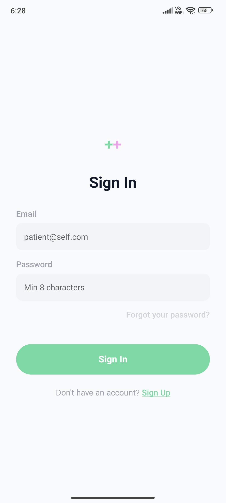
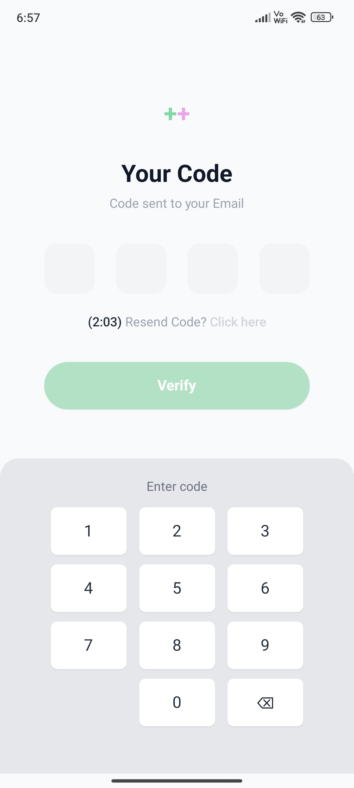
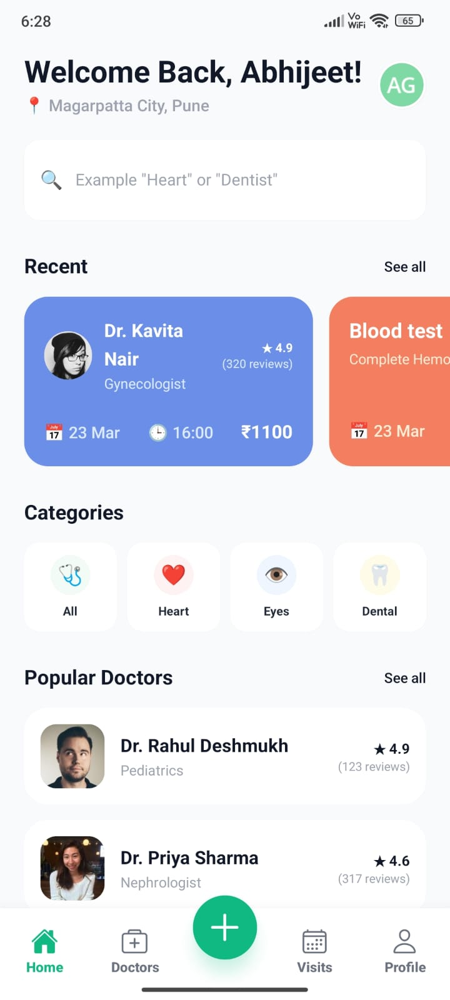
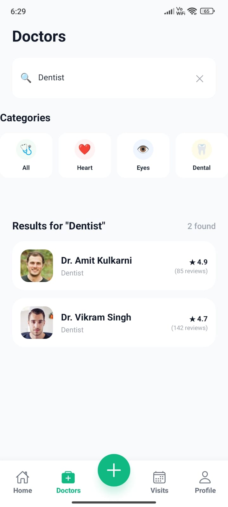
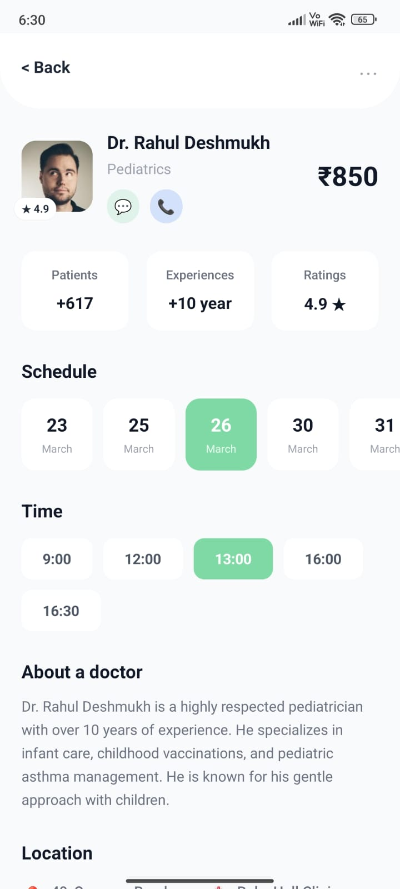
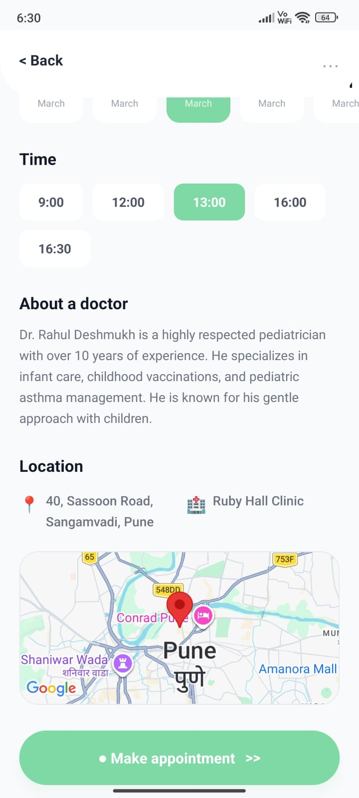
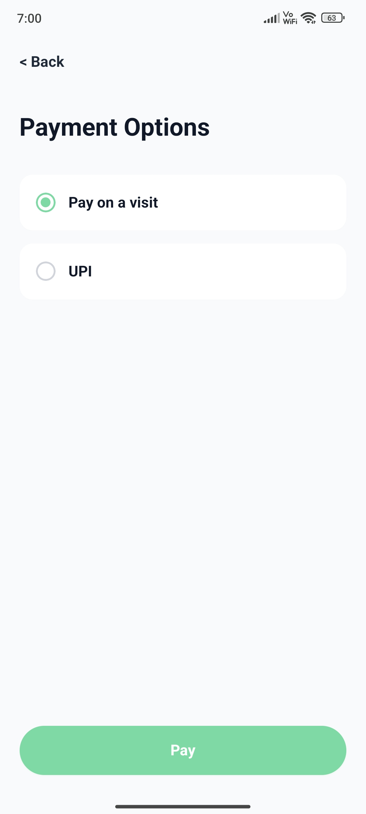
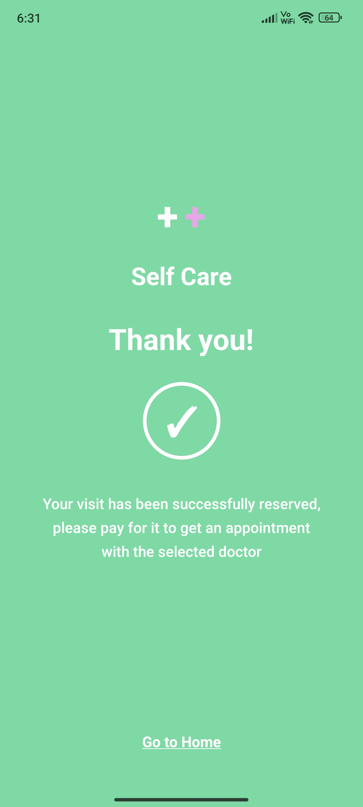
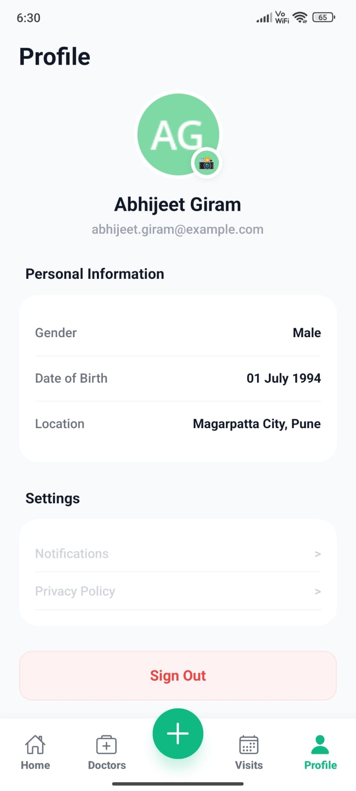
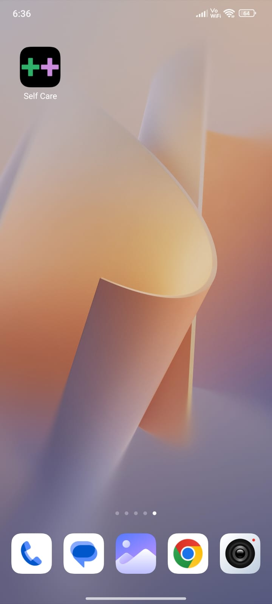

# SelfCare App ++

A high-performance healthcare management mobile application built with **React Native** and **Expo**. Designed with a clean, modern aesthetic and optimized for high-speed user interactions.

## 👤 Developed By

**Abhijeet Giram** _Version: 1.0.0_

---

## 📱 App Structure

The application utilizes **Expo Router** for file-based navigation:

- **(auth)/:** - `sign-in`: Branded login with "Plus-Plus" logo.
  - `sign-up`: New account registration.
  - `verify`: OTP/Verification flow.
- **(tabs)/:**
  - `home`: Dashboard featuring debounced search and Recent Activity slider.
  - `doctors`: Global discovery with keyword-based filtering and specialized pills.
  - `profile`: User management with **Real Camera** integration.
- **doctor/[id]:** Dynamic route featuring **Shared Element Transitions** for seamless image gliding.

---

## 📽 App Flow Demo

Here is a recording of the application flow on a physical device.

  

---

## 📸 App Experience

Explore the intuitive user interface and seamless navigation through key screens of the SelfCare App, showcasing authentication, doctor discovery, appointment booking, and profile management.

  <table>
    <tr>
      <td align="center"><b>1. Sign In</b></td>
      <td align="center"><b>2. Verify</b></td>
    </tr>
    <tr>
      <td><kbd></kbd></td>
      <td><kbd></kbd></td>
    </tr>
  </table>

  <table>
    <tr>
      <td align="center"><b>3. Home</b></td>
      <td align="center"><b>4. Doctor List</b></td>
    </tr>
    <tr>
      <td><kbd></kbd></td>
      <td><kbd></kbd></td>
    </tr>
  </table>

  <table>
    <tr>
      <td align="center"><b>5. Doctor Details</b></td>
      <td align="center"><b>6. Map Location</b></td>
    </tr>
    <tr>
      <td><kbd></kbd></td>
      <td><kbd></kbd></td>
    </tr>
  </table>

  <table>
    <tr>
      <td align="center"><b>7. Payment</b></td>
      <td align="center"><b>8. Appointment</b></td>
    </tr>
    <tr>
      <td><kbd></kbd></td>
      <td><kbd></kbd></td>
    </tr>
  </table>

  <table>
    <tr>
      <td align="center"><b>9. Profile</b></td>
      <td align="center"><b>10. App</b></td>
    </tr>
    <tr>
      <td><kbd></kbd></td>
      <td><kbd></kbd></td>
    </tr>
  </table>

---

## 🛠 Tech Stack & Third-Party Usage

- **Framework:** Expo SDK 50+
- **Styling:** `NativeWind` (Tailwind CSS for React Native)
- **Animations:** `react-native-reanimated` (Shared Transitions & Worklets)
- **Navigation:** `expo-router`
- **Maps:** `react-native-maps` (Real Native Integration)
- **Camera:** `expo-image-picker` (Real Hardware Access)
- **Icons:** Custom "Plus-Plus" (++ logo) branding for high-end healthcare feel.

---

## ⚙️ Mock vs Real Data

- **Mock Data:** Optimized JSON constants (`DOCTORS_LIST`, `RECENT_ACTIVITIES`) for instant loading and architectural modularity.
- **Mock Payment:** A simulated checkout flow for appointment bookings.
- **Real Integration:**
  - **Camera:** Fully functional profile picture capture and update.
  - **Maps:** Real-time native coordinate rendering in Pune locations.
  - **Search:** Sophisticated debounce logic (600ms) to prevent unnecessary re-renders.

---

## 🚀 Testing & Deployment

### Expo Go Testing

1. Install **Expo Go** on your Android/iOS device.
2. Run `npx expo start -c` in your project root.
3. Scan the QR code.
   _Tip: If branding assets (icons/splash) don't update, force-close Expo Go and restart the bundler with the -c flag._

### Build APK (EAS Build)

1. Install EAS CLI: `npm install -g eas-cli`
2. Configure project: `eas build:configure`
3. Generate Preview APK: `eas build -p android --profile preview`

---

## 📈 Analysis

### Pros

- **Debounced Search:** Enhances UX by eliminating "typing lag."
- **Utility Styling:** NativeWind ensures a lean stylesheet and rapid UI iteration.
- **Shared Transitions:** Provides a premium, native-app feel usually found in top-tier apps.
- **Architecture:** Clean separation of constants, components, and routes.

### Cons

- **Babel Sensitivity:** High dependency on correct plugin ordering (`reanimated/plugin` must be last).
- **Native-Only Features:** Shared Element Transitions are skipped on Web builds.

---

## 🔮 Future Enhancements

- Integration of a real Node.js/PostgreSQL or Firebase backend.
- Real-time chat using WebSockets/Socket.io.
- Appointment reminders via Push Notifications.

---

© 2026 SelfCare by Abhijeet Giram.
